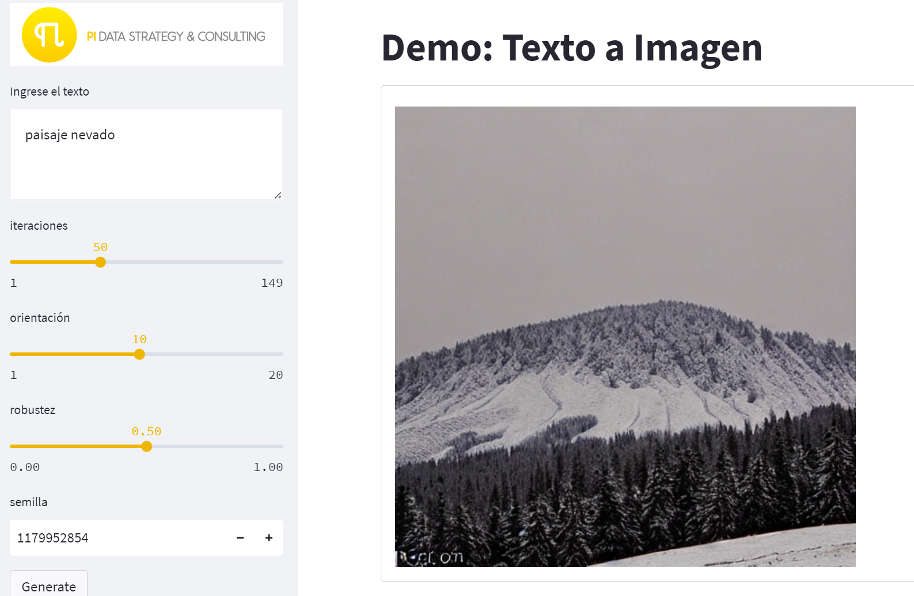

# Demo-expo-cedi

Demostración del algoritmo de stable_diffusion para convertir texto a imagen

<p align="center">
  
</p>

## Despliegue local

```
pip install -r requirements.txt
streamlit run demo_web.py
```
